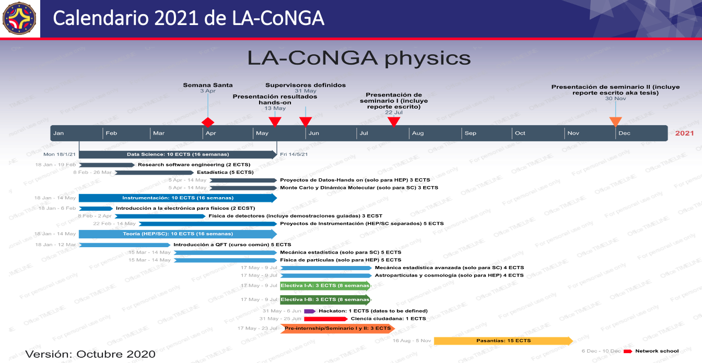

# LA-CoNGA inicia sus cursos 18 enero de 2021

El proyecto ERASMUS+ [*LA-CoNGA Physics*](https://laconga.redclara.net) (por *Latin American Latin American Alliance for Capacity. buildiNG in Advanced Physics*) inicia operaciones el próximo 18 de enero, 2021. A partir de hoy y hasta el 15 enero, abrimos las inscripciones para los interesados en sumarse a este proyecto.

En [*LA-CoNGA Physics*](https://laconga.redclara.net) buscamos desarrollar cursos de posgrado en Física Avanzada, compatibles con el modelo de Boloña, de la Unión Europea. Es un ambicioso proyecto que aglutina ocho universidades en América Latina y tres en Europa. Nuestros cursos serán, un modelo de colaboración científica distribuida, donde los estudiantes desarrollarán proyectos de forma cooperativa desde cuatro países andinos.    

## ¿ Cómo es el programa académico de *LA-CoNGA Physics* ?
Tal y como se puede apreciar en el calendario de asignaturas para el próximo semestre, nuestro programa presenta tres ejes temáticos complementarios:
+ Física Avanzada
+ Instrumentación Científica
+ Ciencia de Datos

Estos tres ejes corresponden a las asignaturas que inician el 18 enero.

   

Como los cursos han sido confeccionados dentro del marco de la convención de Boloña, se basan en una dedicación horaria estándar para nuestros estudiantes: los [ECTS](https://www.study.eu/article/what-is-the-ects-european-credit-transfer-and-accumulation-system) (por *European Credit Transfer System*). De esta forma los cursos que vamos a desarrollar serán equivalentes a los de las maestrías europeas.

En el siguiente semestre, segundo 2021, completaremos con una asignatura electiva para cada eje temático y avanzaremos con un conjunto de actividades complementarias, entre las cuales destacan actividades de ciencia ciudadana y *Hackatones* entre nuestros estudiantes. Finalizaremos con una estancia de investigación en grupos/centros de investigación en América Latina y Europa. Estas pasantías también podrán desarrollarse en nuestros socios industriales.

## ¿ Cuáles asignaturas comienzan en el primer semestre de enero 2021 ?
Como lo detallamos arriba, entre los meses de enero y mayo desarrollaremos tres cursos, cada uno compuesto por varios módulos.

A continuación detallamos el programa de las asignaturas y sus  docentes responsables

### Ciencia de datos (10 ECTS)
Este curso está orientado a proveer de las herramientas y conceptos indispensables para abordar el tratamiento y análisis de grandes volúmenes de datos. Está compuesto por tres módulos y cubren temas tanto de ingeniería de *software* aplicada a proyectos científicos como de estadística matemática. Se hace un especial énfasis en proyectos de aplicación de los conceptos, tanto en temas académicos como industriales.  
Los programas detallados y sus responsables los listamos a continuación:
+ [Ingeniería de software para la investigación](https://github.com/LA-CoNGA/WP1-Preparation/blob/master/syllabus/OurSyllabus/data_programming/ResearchSoftwareEngineeringSyllabusNew.md) (2 ECTS). Responsables:
  + [Arturo Sánchez Pineda](https://laconga.redclara.net/arturo-sanchez-pineda/), *International Centre for Theoretical Physics* (ICTP) Italia y *European Organization for Nuclear Research* (CERN) Suiza.
  + [Juan Carlos Basto Pineda](https://github.com/juan-pineda/bio), Universidad Industrial de Santander, Colombia.
+ [Introducción a la estadística](https://github.com/LA-CoNGA/WP1-Preparation/blob/master/syllabus/OurSyllabus/data_programming/StatisticsSyllabus.md) (5 ECTS). Responsables:
  + [José Ocariz](https://laconga.redclara.net/jose-ocariz/), Université de Paris, Francia.
  + [Camila Rangel](https://laconga.redclara.net/camila-rangel-smith/), The Alan Turing Institute, Reino Unido.  
+ Proyectos *hands-on* de Ciencia de Datos en dos sabores, uno en Física de Altas Energías y otro en Sistemas Complejos:
  + [Proyectos en Física de Altas Energías](https://github.com/LA-CoNGA/WP1-Preparation/blob/master/syllabus/OurSyllabus/data_programming/HandsOnDataProjects.md) Solo para la especialidad de Física de Altas Energías (3 ECTS). Responsables:
    + [Arturo Sánchez Pineda](https://laconga.redclara.net/arturo-sanchez-pineda/), *International Centre for Theoretical Physics* (ICTP) Italia y *European Organization for Nuclear Research* (CERN) Suiza.
    + [Javier Solano](https://laconga.redclara.net/javier-solano/), Universidad Nacional de Ingeniería, Perú.
  + [Proyectos de Sistemas Complejos en Dinámica Molecular](https://github.com/LA-CoNGA/WP1-Preparation/blob/master/syllabus/OurSyllabus/data_programming/MonteCarloAndMolecularDynamics.md) Sólo para la especialidad de Sistemas Complejos (3 ECTS). Responsable: [Ernesto Medina](https://laconga.redclara.net/ernesto-medina/), Yachay Tech, Ecuador.   

### Instrumentación científica (10 ECTS)
Este curso está orientado a proveer de las herramientas y conceptos indispensables para implementar sistemas e interfaces en instrumentación científica. Está compuesto de tres módulos:
+ [Introducción a sistemas de medidas](https://github.com/LA-CoNGA/WP1-Preparation/blob/instrumentation/syllabus/OurSyllabus/IntroductionToMeasurementSystemsSyllabus.md) (2 ECTS). Responsable: [Dennis Cazar](https://laconga.redclara.net/dennis-cazar/), Universidad San Francisco de Quito, Ecuador.
+ [Instrumentación Científica](https://github.com/LA-CoNGA/WP1-Preparation/blob/instrumentation/syllabus/OurSyllabus/InstrumentationSyllabus.md) (3 ECTS). Responsables:
  + [Reina Camacho Toro](https://laconga.redclara.net/reina-camacho-toro/), Centre National de la Recherche Scientifique (CNRS), Francia.
  + [Harold Yepes Ramírez](https://laconga.redclara.net/harold-yepes-ramirez/), Yachay Tech, Ecuador.
+ [Proyectos *hands-on* de Instrumentación Científica](https://github.com/LA-CoNGA/WP1-Preparation/blob/instrumentation/syllabus/OurSyllabus/InstrumentationResearchProjects.md) (5 ECTS) en dos sabores, uno en Física de Altas Energías y otro en Sistemas Complejos. Responsables:
  + [Luis A. Núñez](https://laconga.redclara.net/luis-a-nunez/), Universidad Industrial de Santander Colombia.
  + [Mario Cosenza](https://scholar.google.com/citations?hl=en&user=wmSC_7EAAAAJ), Yachay Tech, Ecuador.

### Teoría (10 ECTS)
El objetivo de este curso es comprender el formalismo básico de la Teoría  de Campos, así como también sus aplicaciones en la Física de las Partículas y la teoría de la Materia Condensada. El primer módulo de este curso es común a las dos especialidades: Sistemas Complejos y Física de Altas Energías. Luego se diversifica en dos módulos específicos para cada una de nuestras especialidades.
  + [Introducción a la Teoría de Campos](https://github.com/LA-CoNGA/WP1-Preparation/blob/theory/syllabus/OurSyllabus/IntroductionToQFT.md) (5 ECTS). Responsables:
    + [José Ocariz](https://laconga.redclara.net/jose-ocariz/), Université de Paris, Francia.
    + [Anamaría Font](https://inspirehep.net/authors/1009735), Universidad Central de Venezuela, Venezuela y *Albert-Einstein-Institut, Max-Planck-Institut für Gravitationsphysik*, Alemania.
    + [Jorge Stephany](https://laconga.redclara.net/jorge-stephany/), Universidad Simón Bolívar, Venezuela.
  + [Teoría de Campos y Mecánica Estadística](https://github.com/LA-CoNGA/WP1-Preparation/blob/theory/syllabus/OurSyllabus/FieldTheoryForStatisticalMechanics.md) Sólo para la especialidad de Sistemas Complejos (5 ECTS). Responsable: [Pierre Pujol](https://laconga.redclara.net/pierre-pujol/), *Université Paul Sabatier*, Francia.
  + [Introducción a la Física de Partículas](https://github.com/LA-CoNGA/WP1-Preparation/blob/theory/syllabus/OurSyllabus/ParticlePhysics.md) Solo para la especialidad de Física de Altas Energías (5 ECTS). Responsables:
     + [Gabriela Navarro](https://laconga.redclara.net/gabriela-navarro/), Universidad Antonio Nariño, Colombia.
     + [José Antonio López](https://laconga.redclara.net/jose-antonio-lopez/), Universidad Central de Venezuela, Venezuela.
